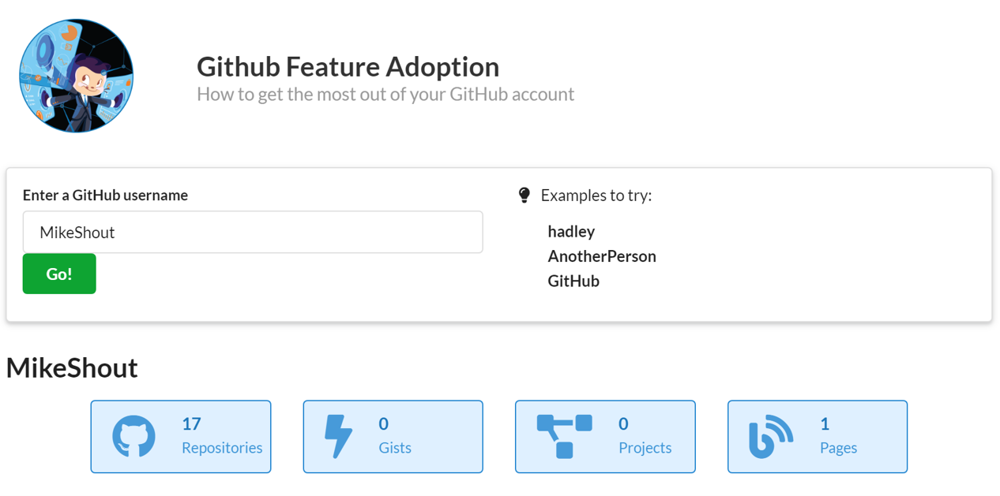

# GitHub Feature Adoption
## How to get the most out of your GitHub account
This is a shiny app dashboard that summarizes GitHub feature adoption for GitHub users with recommendations to get more out of their service.

The shinyapp is here: https://mikeshout.shinyapps.io/GitHub_Adoption_Dashboard/

The app works as follows, 

* User enters a GitHub user name
* The app calls certain Github API endpoints and retrieves feature usage data 
* The data is summarized on counts and time
* Basic charts are updated to visualize
* The app provides recommendations based on the GitHub users activity
 